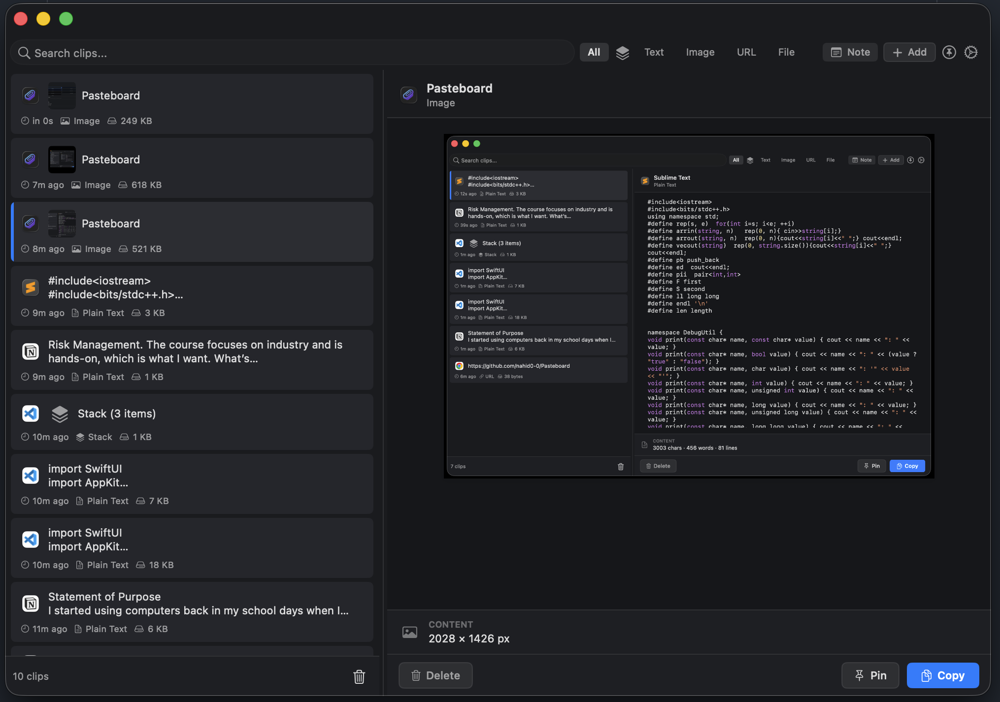
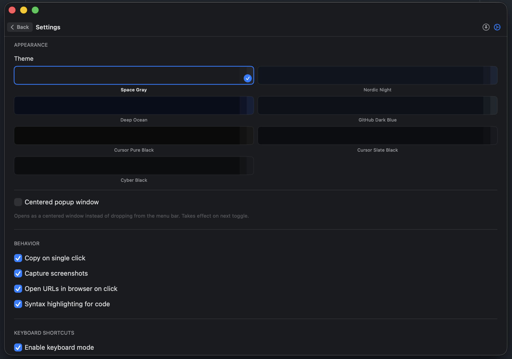
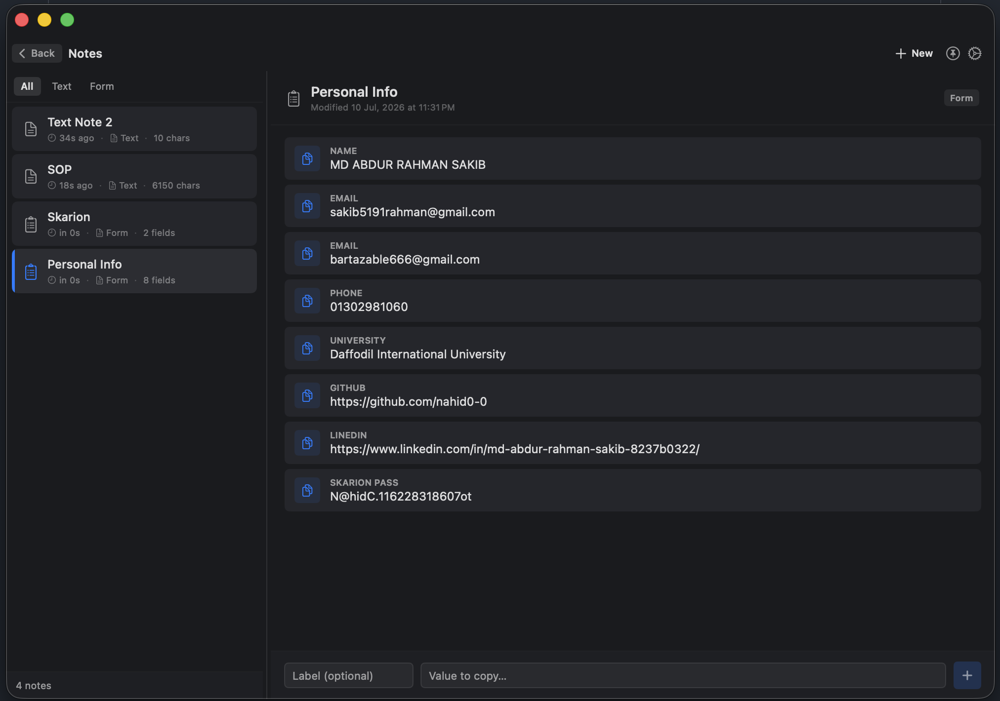
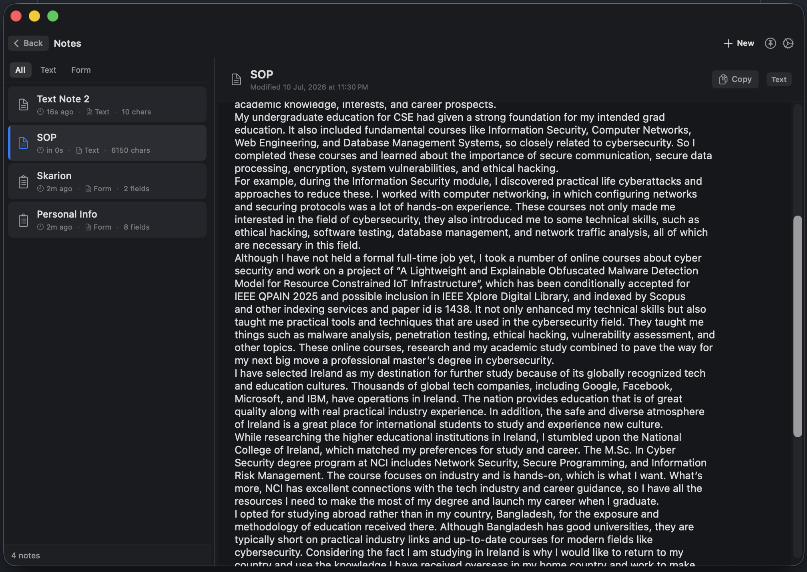

# Pasteboard

**A lightweight clipboard manager for macOS that lives in your menu bar.**

---

<table>
  <tr>
    <td></td>
    <td></td>
  </tr>
  <tr>
    <td></td>
    <td></td>
  </tr>
</table>

---

## Features

| Feature | Description |
|---|---|
| **Clipboard History** | Automatically tracks text, images, URLs, and files |
| **Screenshot Detection** | Captures screenshots directly into your history |
| **Notes** | Create plain text or form notes — copy individual fields with one click |
| **Stack Mode** | Batch-collect multiple copies into a single stack item |
| **Rich Previews** | Preview clips with syntax highlighting for code |
| **Search & Filter** | Filter by type — Text, Image, URL, or File — and search by content |
| **Keyboard First** | Configurable global hotkey, arrow key navigation, one-key copy |
| **Pin Clips** | Pin frequently used clips so they always stay at the top |
| **Persistent Storage** | History and notes survive app restarts |
| **Themes** | Multiple dark themes to match your setup |

---

## Usage

| Action | How |
|---|---|
| Open | Click the menu bar icon, or press your global hotkey |
| Copy a clip | Click any item — or press Return when selected |
| Filter | Use the type pills at the top — All, Text, Image, URL, File |
| Search | Type in the search bar (Shift+Left to focus) |
| Navigate | Arrow keys move through the list |
| Stack mode | Enable via the toolbar to batch-collect copies |
| Notes | Navigate to Notes via the toolbar |
| Settings | Gear icon in the top-right corner |

---

## Permissions

| Permission | Purpose | Required |
|---|---|---|
| **Accessibility** | Register and receive global hotkeys | Yes |
| **Screen Recording** | Detect screenshots via CGWindowList | Optional |

---

Copyright © 2026 Nahid Rahman. All rights reserved.

